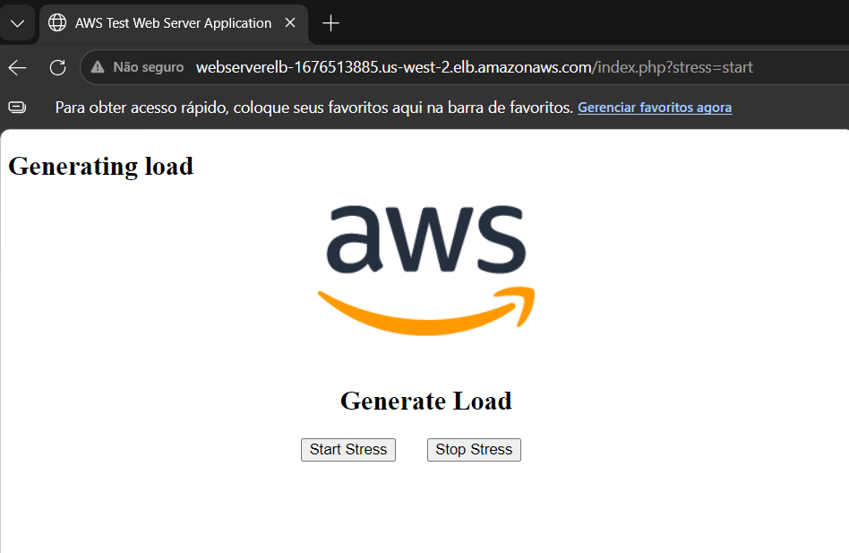
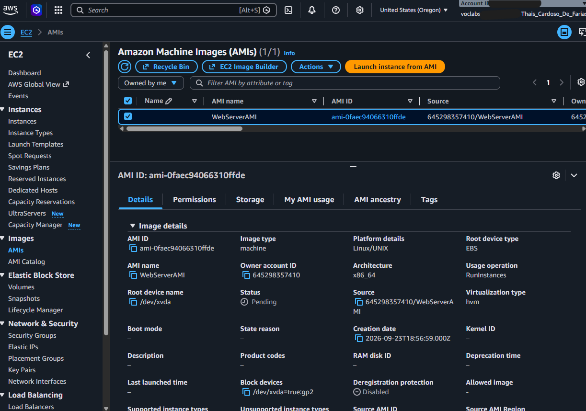
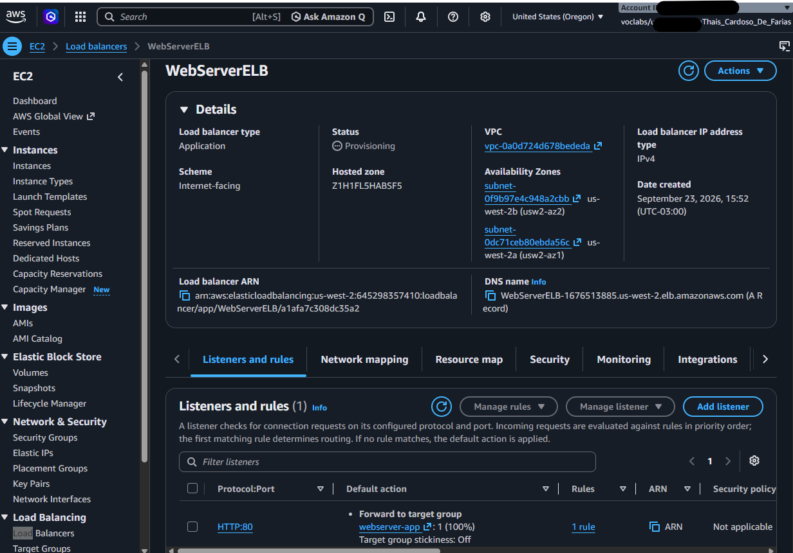
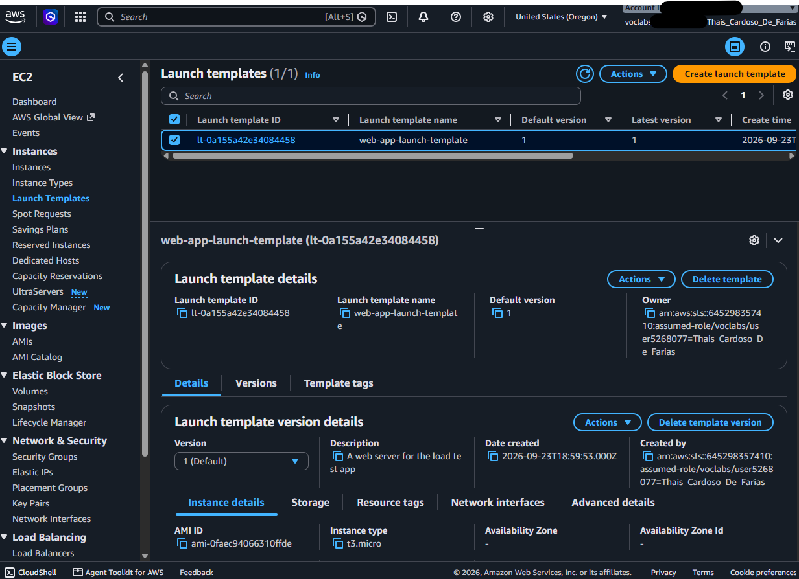
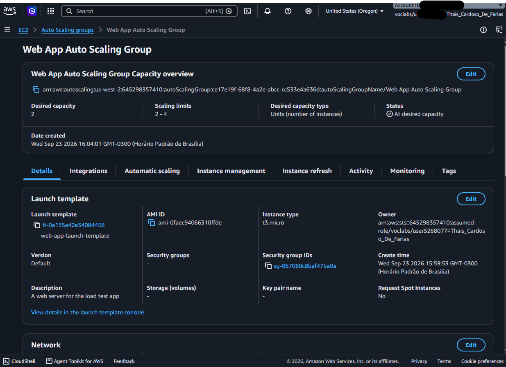
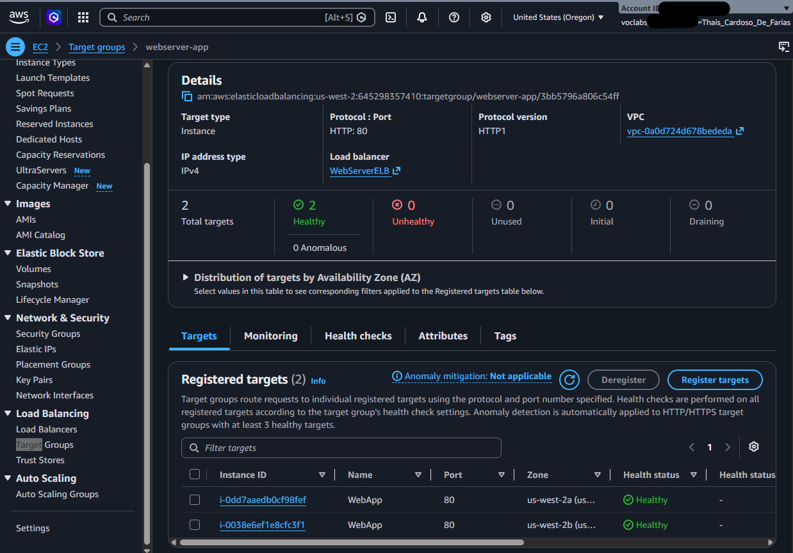
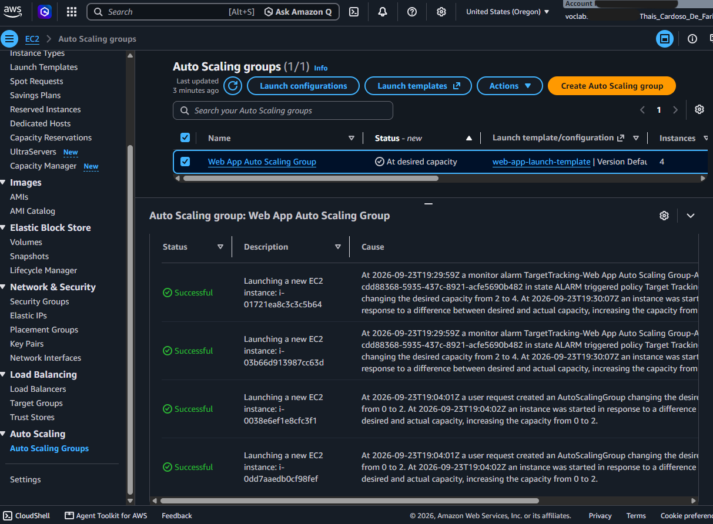
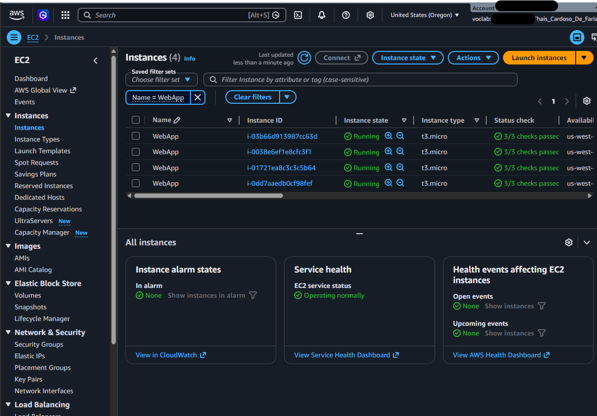

# 🚀 AWS Infrastructure: High Availability & Auto Scaling

Projeto prático de implementação de uma arquitetura web resiliente, altamente disponível e escalável na AWS, utilizando **Amazon EC2 Auto Scaling**, **Application Load Balancer (ALB)**, **Launch Templates** e **AWS CLI**.

---

## 📌 Visão Geral do Projeto

O objetivo deste projeto foi construir uma infraestrutura na nuvem AWS capaz de absorver picos de tráfego automaticamente e garantir alta disponibilidade (HA) sem intervenção manual. 

A aplicação web foi hospedada em instâncias EC2 distribuídas em **Sub-redes Privadas** através de duas **Zonas de Disponibilidade (Multi-AZ)**, protegidas por um **Application Load Balancer** exposto publicamente.

### 🛠️ Serviços e Tecnologias Utilizadas

* **Amazon EC2 & AWS CLI**: Provisionamento e automação de instâncias via linha de comando.
* **Amazon Machine Image (AMI)**: Criação de imagem customizada com a aplicação PHP pré-configurada.
* **Launch Template**: Modelo de configuração reutilizável para inicialização de novas instâncias.
* **Application Load Balancer (ALB)**: Distribuição equilibrada de tráfego HTTP entre as zonas de disponibilidade.
* **Amazon EC2 Auto Scaling**: Grupo de escalonamento automático baseado em métricas de utilização de CPU.
* **Amazon CloudWatch**: Monitoramento e alarmes de métricas em tempo real.
* **VPC & Security Groups**: Isolamento de rede em sub-redes privadas e controle de tráfego.

---

## 🏗️ Arquitetura da Solução

1. **Camada Pública**: O **Application Load Balancer (ALB)** recebe as requisições HTTP da internet através das sub-redes públicas.
2. **Camada Privada**: As instâncias EC2 rodam a aplicação PHP dentro de sub-redes privadas sem IP público direto.
3. **Escalonamento Dinâmico**: O **Auto Scaling Group (ASG)** mantém no mínimo 2 instâncias ativas e escalona até 4 instâncias automaticamente quando a média de utilização de CPU do grupo ultrapassa 50%.

---

## 🚀 Passo a Passo e Evidências

### 1. Criando a AMI Customizada via AWS CLI
Conexão à instância *Command Host* via EC2 Instance Connect para inicialização do servidor web e criação da imagem base do sistema.

#### Aplicação Web em Execução na Instância Base

#### Imagem Customizada (AMI) Criada e Disponível

---

### 2. Configurando o Load Balancer e Launch Template
Criação do Target Group (`webserver-app`), do Application Load Balancer (`WebServerELB`) em múltiplas AZs e do Modelo de Inicialização (`web-app-launch-template`).

#### Application Load Balancer Ativo com Listener HTTP

#### Detalhes do Launch Template

---

### 3. Configuração do Auto Scaling Group (ASG)
Criação do **Web App Auto Scaling Group** integrado ao Target Group e configurado com política de rastreamento de meta (*Target Tracking*) para 50% de CPU.

#### Configurações do Auto Scaling Group

#### Validação de Saúde das Instâncias (Target Group Healthy)

---

### 4. Teste de Carga e Escalonamento Automático (Scale Out)
Ao simular estresse de processamento na aplicação através do DNS do Load Balancer, o **CloudWatch** disparou o alarme de alta carga (`AlarmHigh`), instruindo o Auto Scaling Group a expandir a capacidade de 2 para 4 instâncias automaticamente.

#### Histórico de Atividade do Auto Scaling Disparando o Scale Out

#### Painel de Instâncias EC2 Expandido Automaticamente

---

## 💡 Aprendizados e Conceitos Chave

* **Desacoplamento de Infraestrutura**: Servidores web mantidos em sub-redes privadas aumentam drasticamente a postura de segurança da aplicação.
* **Resiliência Multi-AZ**: A distribuição entre `us-west-2a` e `us-west-2b` previne que falhas físicas em um data center afetem a disponibilidade da aplicação.
* **Automação Sem Intervenção**: As políticas de *Target Tracking* eliminam a necessidade de dimensionamento manual de infraestrutura durante picos inesperados de acesso.
